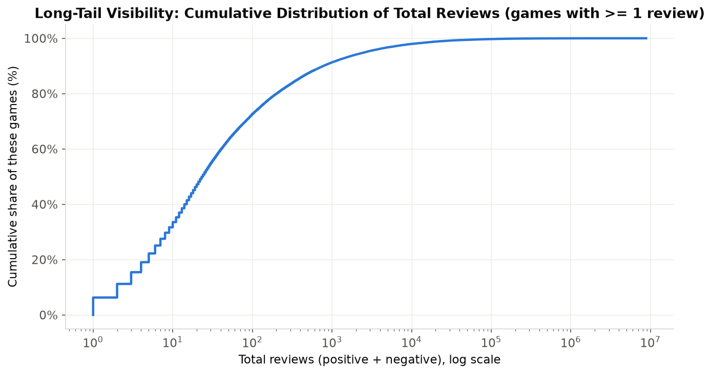
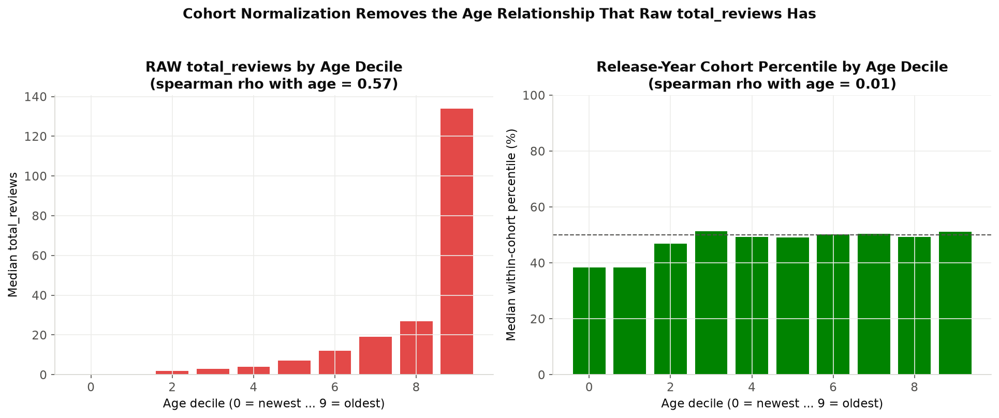
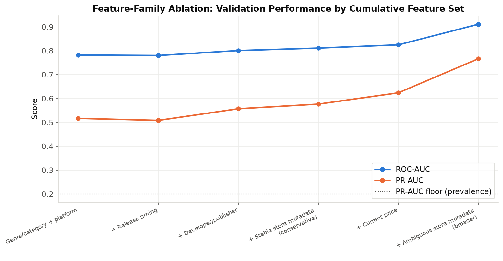
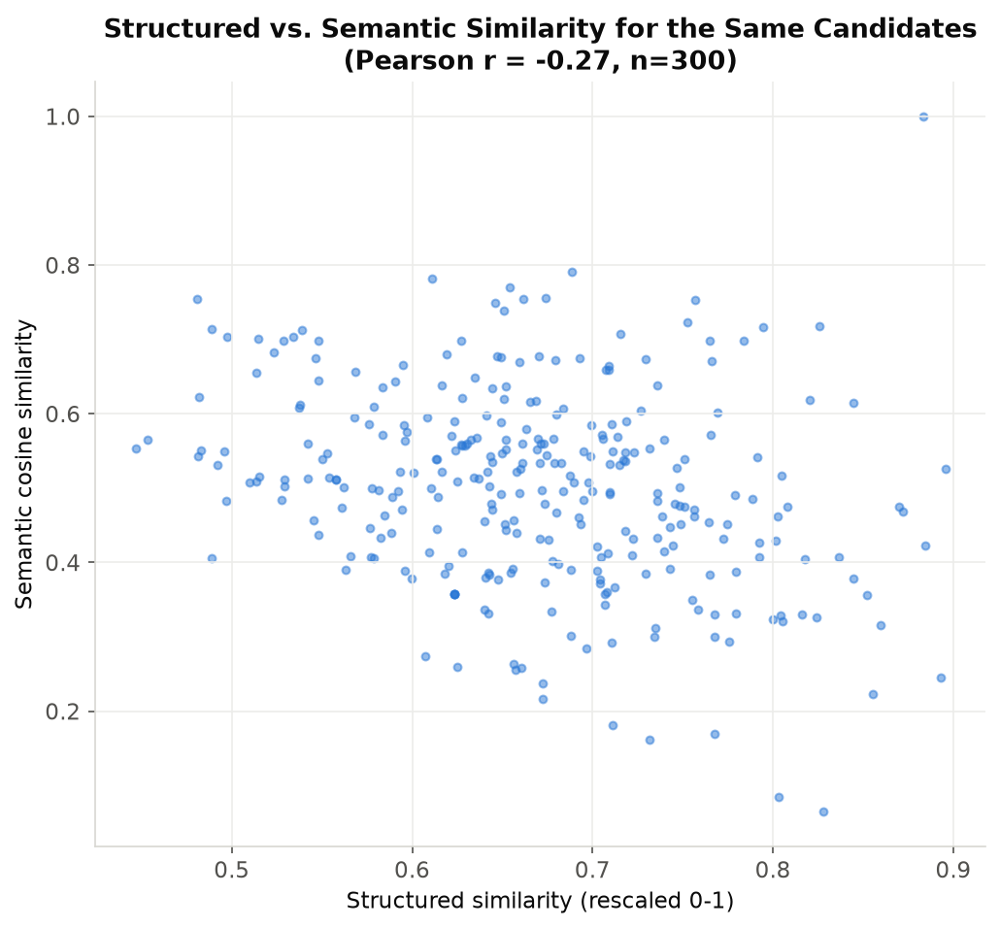
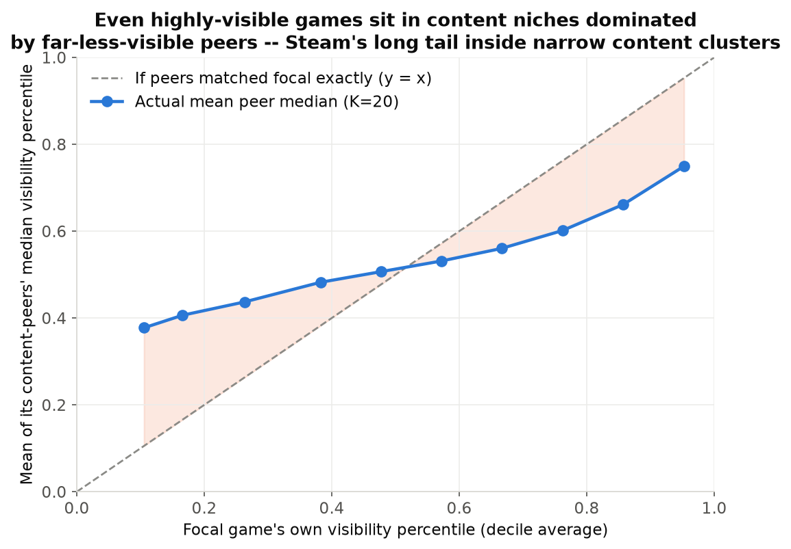

# Steam Games Intelligence

A six-phase data science project on a ~139K-game snapshot of the Steam catalog: what a current, imperfect
snapshot of a large real-world marketplace can — and cannot — reliably tell us about market structure, game
visibility, and content similarity. Every phase starts by auditing what the data actually supports, then
scopes the analysis to match; several planned directions were narrowed or rejected outright once the evidence
came in, and that discipline is the project's actual throughline, not any single model or chart.

## Executive Summary

*(~45 seconds)*

- **Phase 1's data audit changed the roadmap before any modeling began.** The companion "reviews" file,
  documented as up to ~100 structured player reviews per game, turned out empirically to contain a handful of
  concatenated critic/press pull-quotes with no per-review structure — eliminating any player-sentiment/review-NLP
  module outright.
- **Steam's catalog supply is extremely fragmented and long-tail dominated**: ~77% of developers/publishers
  appear in only one catalog record, and ~40% of all games have zero recorded reviews.
- **Raw cumulative popularity is severely confounded by release-date exposure time** (older games have simply
  had longer to accumulate reviews) — Spearman rho = 0.569 between raw review count and game age. A
  release-year cohort-percentile fix, tested against two rejected alternatives, reduces this to rho = 0.011.
- **A leakage-controlled LightGBM classifier**, trained only on static/point-in-time metadata with a strict
  chronological train/validate/test split, predicts cohort-relative visibility at test ROC-AUC 0.80 — and a
  "broader snapshot" variant reaching ROC-AUC 0.91 was deliberately **not** selected as the frozen model once
  a material share of its gain was traced back to features partly downstream of the popularity it predicts.
- **A hybrid structured + semantic representation enables content-based game discovery** (not personalized
  recommendation — no purchase/rating data exists) across the full catalog, with structured and semantic
  similarity scores shown to be genuinely complementary (Pearson r = -0.27 on the same candidates).
- **Combining the visibility model with content similarity** (Phase 6) shows that a game's closest content
  peers are frequently far more or less visible than itself, robustly across K, franchise handling, and
  temporal design choices — Steam's long-tail structure reappears *inside* narrow content niches, not only
  across the catalog as a whole.

## Why This Project Is Methodologically Different

Most portfolio projects on this kind of dataset start from "predict success" and work backward. This one
starts from a rigorous, empirical audit of what a single-snapshot, 42-column CSV can actually support, and
lets the answer shape the plan. That audit surfaced two structural constraints — a mislabeled text field and a
cumulative-outcome/exposure-time confound — that are binding for every later phase, and several methods tested
in this project were deliberately **rejected after being built and evaluated**, not just avoided in theory: a
rolling-window cohort normalization that introduced a worse artifact than the confound it fixed, a composite
success score that added noise rather than information, and a higher-scoring "broader" visibility model whose
gain leaned on popularity-downstream features. Stating what the data cannot support turned out to be as
valuable as what it can.

## Data

Two raw CSVs, joined on `app_id`:

- **`steam_games.csv`** — ~139K rows, 42 columns: pricing, genres/categories/tags, developer/publisher,
  review/popularity counts, playtime, platform support, store descriptions, availability flags.
- **`steam_games_reviews.csv`** — ~13K rows with a free-text field that Phase 1 found does not match its
  documentation: a small number (median 3, max 10) of concatenated critic/press pull-quotes, not player
  reviews.

Both are a **current snapshot** (2026-08-28) of a live, daily-updated dataset, not a historical record — see
[Methodological note](#methodological-note-snapshot-data-and-leakage-risk) below. Not committed to the repo
(one file is ~900 MB); place them at `data/raw/steam_games.csv` and `data/raw/steam_games_reviews.csv`.

## Key Findings

### Market Structure

Catalog growth is compositional, not uniform — Free To Play releases grew ~14.3x (2014-16 to 2023-25) vs.
Action's ~5.8x — and supply is highly fragmented (~77% of developers/publishers appear in only one catalog
record). A genre's all-time popularity ranking can fully invert once release cohort is controlled for
(Massively Multiplayer: highest all-time median reviews, lowest among 2023-24 releases). Full detail:
[`outputs/phase2_market_findings.md`](outputs/phase2_market_findings.md).



### Visibility Modeling

Raw review counts are not a fair cross-game comparison (rho=0.569 vs. game age); a release-year cohort
percentile removes the confound (rho=0.011) without the boundary artifact a rejected rolling-window approach
introduced. A leakage-controlled LightGBM model on static, point-in-time-safe metadata predicts this
cohort-relative visibility with real, chronologically-generalizing signal (test ROC-AUC 0.80). Full detail:
[`outputs/phase3_success_definition.md`](outputs/phase3_success_definition.md),
[`outputs/phase4_modeling_results.md`](outputs/phase4_modeling_results.md).





### Game Similarity & Peer Benchmarking

Structured metadata and semantic text embeddings capture genuinely different, weakly *negatively* correlated
notions of "similar" (Pearson r = -0.27), motivating a transparent hybrid over a single "best" representation.
Benchmarking each game's cohort-relative visibility against its purely content-selected peers (Phase 6) shows
this relationship is robust to reasonable design choices and reveals that Steam's long tail reappears *inside*
narrow content niches — even highly visible games are typically surrounded by far less visible content peers.
Full detail: [`outputs/phase5_similarity_findings.md`](outputs/phase5_similarity_findings.md),
[`outputs/phase6_peer_benchmarking_findings.md`](outputs/phase6_peer_benchmarking_findings.md).





## Methodology / Project Pipeline

Each phase answers one question and hands a fixed, documented decision to the next — nothing downstream
silently re-derives an earlier phase's population, target, or leakage ruling.

| Phase | Question | Status |
|---|---|---|
| 1. Data Audit & Feasibility | What data do we actually have? | Complete |
| 2. Steam Market Analytics | What does the Steam marketplace look like? | Complete |
| 3. Success Definition & Temporal Framing | What does "visibility" legitimately mean in a snapshot? | Complete |
| 4. Cohort-Aware Visibility Modeling | How much visibility signal exists in leakage-controlled metadata? | Complete |
| 5. Game Representation & Content-Based Similarity | How can games be represented for content-based discovery? | Complete |
| 6. Similar-Game Peer Benchmarking & Portfolio Synthesis | What happens when we benchmark visibility against content-similar peers? | Complete |

## Selected Visuals

The five figures above are the project's hero visuals — one per major thread (market structure, temporal
confounding, model ablation, representation comparison, peer benchmarking). Each phase report and notebook
contains its own full figure set (`figures/phase1/` through `figures/phase6/`, 7 figures each on average).

## Repository Structure

```
steam-games-intelligence/
├── README.md
├── requirements.txt
├── .gitignore
├── notebooks/
│   ├── 01_data_audit_and_feasibility.ipynb
│   ├── 02_market_analytics.ipynb
│   ├── 03_success_definition_and_temporal_framing.ipynb
│   ├── 04_cohort_aware_visibility_modeling.ipynb
│   ├── 05_game_representation_and_similarity.ipynb
│   └── 06_peer_benchmarking_and_synthesis.ipynb
├── src/
│   ├── audit_utils.py            # reusable parsing utilities discovered during the audit
│   ├── market_utils.py           # Phase 2 transforms (price tiers, cohort/genre helpers, games_clean builder)
│   ├── modeling_utils.py         # Phase 4 transforms (multi-hot encoding, point-in-time prior counts, metrics)
│   ├── similarity_utils.py       # Phase 5 transforms (structured/TF-IDF representations, retrieval, hybrid scoring)
│   └── peer_benchmark_utils.py   # Phase 6 transforms (batched retrieval, peer-relative visibility gap)
├── figures/
│   ├── phase1/ … phase6/         # each phase's diagnostic/final figures
├── data/
│   ├── raw/                      # place steam_games.csv / steam_games_reviews.csv here (gitignored)
│   └── processed/
│       ├── games_clean.parquet         # normalized game-level table (see notebook 02)
│       ├── modeling_frame.parquet      # 2017-2023 modeling population + target + predictors (see notebook 03)
│       ├── similarity_frame.parquet    # similarity population + normalized text/metadata (gitignored, ~123MB, notebook 05)
│       └── similarity_embeddings.npy   # cached MiniLM embeddings (gitignored, ~199MB, notebook 05, reused unchanged by notebook 06)
└── outputs/
    ├── feasibility_summary.md, feature_role_audit.csv, join_summary.csv        (Phase 1)
    ├── phase2_market_findings.md                                              (Phase 2)
    ├── phase3_success_definition.md, phase3_leakage_map.csv                   (Phase 3)
    ├── phase4_modeling_results.md, phase4_feature_manifest.csv, ...           (Phase 4)
    ├── phase5_similarity_findings.md, phase5_anchor_games.csv, ...            (Phase 5)
    ├── phase6_peer_benchmarking_findings.md, phase6_peer_benchmarks.csv, ...  (Phase 6)
    └── final_project_summary.md                                              (project-level technical synthesis)
```

## Reproducibility

```bash
pip install -r requirements.txt
# place steam_games.csv and steam_games_reviews.csv under data/raw/
jupyter notebook notebooks/01_data_audit_and_feasibility.ipynb
```

Run notebooks **in order, 01 → 06** — each writes a `data/processed/*.parquet` or `outputs/*` artifact the
next notebook reads back. `games_clean.parquet` and `modeling_frame.parquet` are small and committed to the
repo; `similarity_frame.parquet` and `similarity_embeddings.npy` (notebook 05) are large, deterministic, and
git-ignored — they regenerate locally from `steam_games.csv`. **The semantic embedding step in notebook 05
took ~22 minutes of CPU time on the development machine** (a mid-range laptop, no GPU); every later notebook,
including 06, loads that cached `.npy` file rather than recomputing it. No other step in the project takes
more than a few minutes.

## Limitations

1. Single current snapshot (2026-08-28) — not a historical or panel dataset.
2. Cumulative outcomes cannot support true pre-launch forecasting.
3. The `reviews` file contains critic pull-quotes, not player-review text — no player-sentiment analysis is
   possible with this data.
4. Content similarity (Phase 5-6) has no independent user-preference ground truth to validate against.
5. Some current store metadata (price, tags, achievements) is downstream/temporally ambiguous relative to
   launch and was excluded from, or flagged within, the frozen Phase 4 model accordingly.
6. Phase 6 peer benchmarking is descriptive, not causal — it identifies *where* visibility diverges from
   content peers, never *why*.

## Detailed Phase Reports

Each phase's full write-up, evidence, and figures live in its own notebook + `outputs/*.md` report — the
README stays a portfolio overview, these carry the methodological detail:

- **Phase 1:** [`outputs/feasibility_summary.md`](outputs/feasibility_summary.md) · `notebooks/01_data_audit_and_feasibility.ipynb`
- **Phase 2:** [`outputs/phase2_market_findings.md`](outputs/phase2_market_findings.md) · `notebooks/02_market_analytics.ipynb`
- **Phase 3:** [`outputs/phase3_success_definition.md`](outputs/phase3_success_definition.md) · `notebooks/03_success_definition_and_temporal_framing.ipynb`
- **Phase 4:** [`outputs/phase4_modeling_results.md`](outputs/phase4_modeling_results.md) · `notebooks/04_cohort_aware_visibility_modeling.ipynb`
- **Phase 5:** [`outputs/phase5_similarity_findings.md`](outputs/phase5_similarity_findings.md) · `notebooks/05_game_representation_and_similarity.ipynb`
- **Phase 6:** [`outputs/phase6_peer_benchmarking_findings.md`](outputs/phase6_peer_benchmarking_findings.md) · `notebooks/06_peer_benchmarking_and_synthesis.ipynb`
- **Project-level technical synthesis:** [`outputs/final_project_summary.md`](outputs/final_project_summary.md)

## What This Project Demonstrates

- **Empirical data-quality auditing** — every structural claim about the dataset (the reviews-field mismatch,
  the two/three list-serialization formats, the exposure-time confound) was discovered by inspecting the
  data, not assumed from documentation.
- **Large tabular data processing** — a 139K-row, 42-column, ~900 MB CSV handled without chunking; a
  129,847 x 384 semantic embedding matrix built and cached locally.
- **Product/market analytics** — cohort-aware, causally-cautious descriptive analysis of a real two-sided
  marketplace.
- **Temporal leakage control and chronological validation** — point-in-time developer/publisher features,
  a strict train/validate/test split by release year, individual-feature leakage rulings (not just family-level).
- **Interpretable gradient boosting with honest ablation** — LightGBM with a documented feature-family
  ablation, and a deliberate choice of a lower-scoring model once a leakage-adjacent confound was found in the
  higher-scoring one.
- **Sparse text representation and sentence embeddings** — TF-IDF and locally-run transformer embeddings
  (`sentence-transformers`), compared rather than assumed interchangeable.
- **Similarity retrieval at scale** — batched dense/sparse top-K retrieval across ~130K and ~64K-game
  corpora, with a documented, vectorized franchise-suppression heuristic.
- **Error and failure analysis** — validation error-composition breakdowns (Phase 4), representation failure
  cases (Phase 5), and a flagged weak-peer-set case study (Phase 6) — each treated as a finding, not an
  afterthought.
- **Reproducible analytical design** — every phase's population, target, and leakage decisions are
  materialized as versioned artifacts (`outputs/*.csv`, `data/processed/*.parquet`) that later phases read
  back rather than re-derive.

## Methodological note: snapshot data and leakage risk

Because the data is a single current-day snapshot, fields like `estimated_owners`, `positive`/`negative`
review counts, `recommendations`, and `average_playtime_forever` are **cumulative outcomes measured today**,
not values known at each game's launch. Older games have had more time to accumulate owners, reviews, and
playtime than newer ones — Phase 1 confirms this exposure-time effect is severe (see
`figures/phase1/05_outcome_vs_release_year_exposure_time.png`). `price` is documented as current price and
cannot be assumed equal to launch price. Every predictive/descriptive claim in this project is scoped around
this constraint — see `outputs/feasibility_summary.md` for how each module was originally scoped, and
`outputs/final_project_summary.md` for the full accounting of what was rejected along the way.
